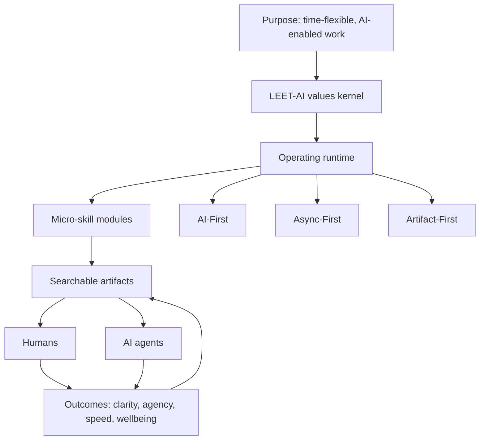
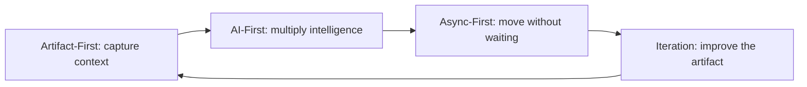

# Culture Skills Library

**Culture Skills are portable, Markdown-native operating instructions for humans and AI agents.**

This repository packages a full culture operating system as modular skills. It is designed for teams that want their values, communication norms, decision rules, documentation practices, and AI-agent behaviors to be explicit enough to teach, fork, adapt, and run. The folder names intentionally use company-neutral identifiers so teams can adopt the system inside their own organizations without making it feel exclusive to any single company.

> A culture skill is not a slogan or a handbook page. It is an operational artifact that tells humans and AI agents how work should happen in recurring situations.

## Why This Exists

Traditional culture documentation was built for co-located teams, synchronous meetings, and human-only execution. Modern teams are increasingly distributed across time zones, assisted by AI agents, and dependent on written context. In that environment, vague values and static handbooks are not enough. A team needs a culture system that can guide daily behavior, route decisions, and create shared memory.

The Culture Skills Library turns culture into a set of reusable operating modules. Each skill is written as a `SKILL.md` file that can be read by a person, embedded into an onboarding flow, or supplied as context to an AI agent. The result is a practical bridge between **what a team believes** and **how the team behaves**.

| Old Pattern | Failure Mode | Culture Skills Pattern |
|---|---|---|
| Values live in a handbook. | People admire them but do not know what to do differently. | Values are translated into operating principles, default questions, anti-patterns, and proof artifacts. |
| Meetings carry most context. | Work slows down when people are offline or absent. | Async-first and artifact-first practices make context searchable and reusable. |
| AI usage is individual and inconsistent. | Teams get uneven quality, hidden prompts, and unclear accountability. | AI-first guidance tells humans and agents how to collaborate transparently. |
| Culture depends on tribal knowledge. | New hires and AI agents cannot infer the operating model reliably. | Skills make the operating model explicit, teachable, and forkable. |

## System Architecture

The library uses a **micro-skills architecture**. The `culture-os` skill is the master index and operating-system kernel. It explains the LEET-AI values framework, the three foundational methodologies, and the routing logic for seven specialized micro-skills.



The architecture is intentionally simple. **Values are the kernel**, because they define what good judgment looks like. **Methodologies are the runtime**, because they translate values into recurring ways of working. **Micro-skills are modules**, because each one handles a specific operating domain. **Artifacts are shared memory**, because durable written outputs let humans and AI agents build on the same context. Maintained Mermaid sources for the repository diagrams live in [`docs/visuals`](./docs/visuals).

## Skill Map

| Skill | Role in the System | Use It When |
|---|---|---|
| **[culture-os](./culture-os)** | Master operating-system skill for values, methodologies, routing, and adoption. | You need the front door, the system map, or cross-cutting cultural guidance. |
| **[manager-of-one](./manager-of-one)** | Self-management module for autonomy, task systems, time-boxing, and personal operating rhythm. | You are designing personal productivity, ownership, capacity, or autonomy practices. |
| **[ai-first](./ai-first)** | AI-collaboration module for prompting, agent selection, tool use, and transparent AI-assisted work. | You are integrating AI into everyday workflows or creating AI-agent behavior rules. |
| **[async-first](./async-first)** | Communication module for async norms, the 3x Rule, Slack hygiene, and non-linear workdays. | You are improving communication, scheduling, time-zone collaboration, or response expectations. |
| **[artifact-first](./artifact-first)** | Documentation module for searchable artifacts, meeting hygiene, and the Osmosis Signal. | You are building knowledge management, meeting practices, or documentation discipline. |
| **[culture-hiring](./culture-hiring)** | Hiring module for candidate archetypes, screening questions, work samples, and LEET-AI evaluation. | You are designing hiring loops, interviews, scorecards, or candidate assessments. |
| **[leadership-collaboration](./leadership-collaboration)** | Leadership module for Architect/Coach/Editor behaviors, DACI decisions, and team agreements. | You are creating leadership expectations, collaboration systems, or decision frameworks. |
| **[employment-wellbeing](./employment-wellbeing)** | Employment and wellbeing module for fractional work, rest ethics, and sustainable high performance. | You are designing employment models, onboarding, wellbeing policies, or sustainable performance systems. |

## The Methodology Flywheel

The three foundational methodologies reinforce one another. Artifact-first work creates the durable context that AI agents need. AI-first work multiplies the team’s intelligence and output. Async-first work lets people move without waiting for everyone to be online. Iteration improves the artifact, and the cycle repeats.



| Methodology | Default Question | Primary Benefit | Related Skill |
|---|---|---|---|
| **AI-First** | What AI agent can help me here? | Better leverage, faster drafting, broader thinking, and higher-quality iteration. | [`ai-first`](./ai-first) |
| **Async-First** | How would I move this forward if no one else were awake? | Less waiting, fewer unnecessary meetings, and more respect for focus time. | [`async-first`](./async-first) |
| **Artifact-First** | Where should this be searchable? | Stronger shared memory, easier onboarding, and better AI-agent context. | [`artifact-first`](./artifact-first) |

## Quick Start

Start with `culture-os`, because it explains the values kernel and tells you which micro-skills to read next. A team can evaluate the system in thirty minutes by reading `culture-os`, choosing two micro-skills that match current pain points, and adapting one operating ritual immediately. For example, a team struggling with meetings might pair `async-first` with `artifact-first`, while a team scaling hiring might pair `culture-hiring` with `leadership-collaboration`.

| Time Available | Recommended Path | Output |
|---|---|---|
| **30 minutes** | Read [`culture-os`](./culture-os), scan the skill map, and choose one operating pain point. | A short list of the one or two skills to adopt first. |
| **One day** | Fork the repository, customize terminology, and run one live workflow using the relevant skill. | A team-specific version of the chosen skill and one example artifact. |
| **One week** | Install the skills into onboarding, meeting, hiring, or AI-agent workflows. | A repeatable operating practice supported by documentation. |
| **Two weeks** | Review what changed, remove language that does not fit your organization, and add local examples. | A durable culture-skills fork that reflects how your team actually works. |

## How Humans Use These Skills

Humans can use the skills as onboarding material, training curricula, management references, hiring guides, and team operating agreements. The important practice is to treat each skill as an editable operating artifact rather than an inspirational document. If a value is unclear, add a default question. If a norm is ignored, add the anti-pattern. If a process works, add the proof artifact that shows it happened.

| Scenario | Skill Path | Example Artifact |
|---|---|---|
| A new teammate needs to understand how the team works. | `culture-os` → `manager-of-one` → `async-first` | Onboarding checklist, personal operating manual, async communication agreement. |
| A team wants to reduce unnecessary meetings. | `culture-os` → `async-first` → `artifact-first` | Meeting replacement memo, decision log, thread summary template. |
| A hiring loop needs stronger culture alignment. | `culture-os` → `culture-hiring` → `leadership-collaboration` | Interview scorecard, work sample prompt, LEET-AI evaluation rubric. |
| A manager wants clearer decision ownership. | `culture-os` → `leadership-collaboration` → `artifact-first` | DACI decision document, team agreement, public decision archive. |
| A team wants to collaborate better with AI. | `culture-os` → `ai-first` → `artifact-first` | Prompt log, AI-assisted draft, evaluation checklist, reusable context pack. |

## How AI Agents Use These Skills

AI agents can use these files as operating context. The expected pattern is simple: read `culture-os` first, route to the relevant micro-skill, produce a clear artifact, and explain assumptions. Agents should not treat the skills as generic style guides. They are behavioral instructions for how to make decisions, structure work, and collaborate with humans.

| Agent Behavior | Expected Standard |
|---|---|
| **Routing** | Start with `culture-os`, then read the most relevant micro-skill before generating work. |
| **Context handling** | Prefer explicit documented context over inference. Ask when a missing decision would materially change the output. |
| **Artifact creation** | Produce searchable, structured artifacts that can be reused by future humans and agents. |
| **Transparency** | State assumptions, trade-offs, and where AI judgment was applied. |
| **Iteration** | Treat first outputs as drafts and improve them based on feedback rather than defending them. |

## Customizing the Library

This repository is a reference implementation, not a demand for uniformity. Teams should fork it and adapt the language, examples, tools, rituals, and operating cadences to match their own context. The safest customization pattern is to preserve the architecture while localizing the details.

| Preserve | Customize |
|---|---|
| A master operating-system skill that explains the values, methods, and routing logic. | The specific vocabulary, examples, tool references, and adoption sequence. |
| A small number of values that map to observable behavior. | The names, definitions, anti-patterns, and proof artifacts for those values. |
| Separate micro-skills for distinct operating domains. | Which micro-skills you keep, merge, rename, or expand. |
| Explicit AI-agent instructions. | Your team’s risk tolerance, approval rules, compliance needs, and preferred agent stack. |

## Repository Structure

```text
culture-skills/
├── README.md
├── culture-os/
│   └── SKILL.md
├── manager-of-one/
│   └── SKILL.md
├── ai-first/
│   └── SKILL.md
├── async-first/
│   └── SKILL.md
├── artifact-first/
│   └── SKILL.md
├── culture-hiring/
│   └── SKILL.md
├── leadership-collaboration/
│   └── SKILL.md
└── employment-wellbeing/
    └── SKILL.md
```

## Learn More

Visit [lovie.co/culture/skills](https://www.lovie.co/culture/skills) for the interactive Culture Skills experience. Begin with [`culture-os`](./culture-os), then route to the micro-skills that fit your team’s highest-leverage operating problems.

## License

This work is shared openly as part of the [Future of Work 2.0](https://www.lovie.co/culture) movement.
