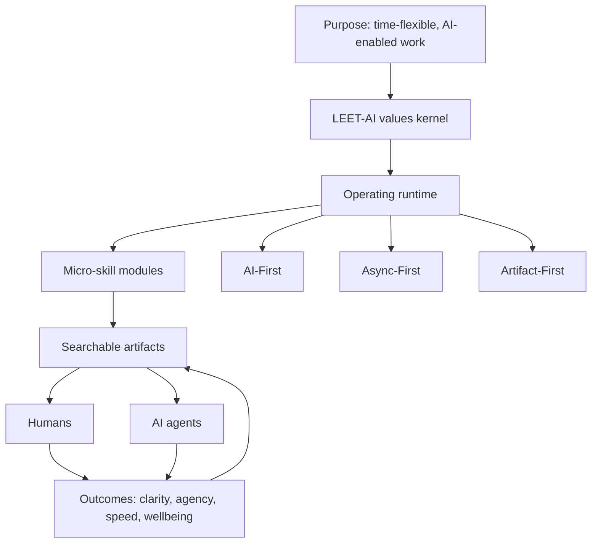
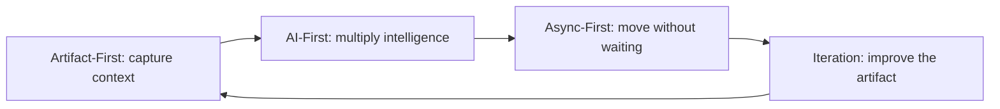
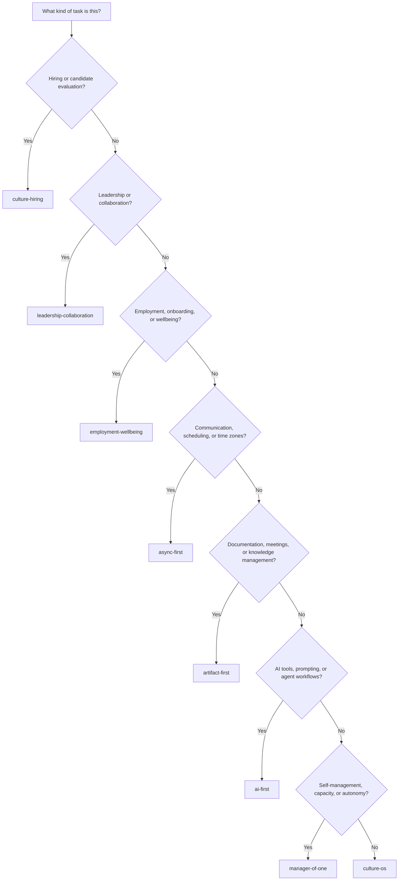

# Culture Operating System

This is the master index for the Future of Work 2.0 culture. It provides the foundational values framework, the operating methodology, and the routing logic for seven specialized micro-skills. **Read this skill first, then read the specific micro-skill or micro-skills relevant to your task.**

> Culture is not a poster, a handbook, or a meeting cadence. Culture is the operating system that determines how people and AI agents make decisions, share context, create artifacts, and improve the work together.

## 1. The Problem: Culture Was Built for Co-Located Humans

Most company cultures were designed for a world where teams worked in the same office, overlapped for the same hours, and relied on meetings to transmit context. That model breaks down when teams become distributed, time-flexible, AI-enabled, and dependent on written knowledge. The problem is not that people stop caring about culture. The problem is that culture remains implicit while the work becomes more complex.

A conventional handbook can describe what a team values, but it rarely tells a person or an AI agent what to do when facing a specific decision. A meeting can create alignment for the people present, but the alignment decays when the recording, decision, and rationale are not turned into a searchable artifact. A direct message can solve a problem quickly, but it can also trap knowledge in private channels where future teammates and AI agents cannot reuse it.

| Traditional Culture Pattern | Why It Fails in AI-Enabled, Distributed Work | Operating-System Replacement |
|---|---|---|
| Values are written as broad ideals. | People agree with the words but interpret behavior differently. | Values become default questions, observable behaviors, anti-patterns, and proof artifacts. |
| Meetings are the default coordination mechanism. | Work waits for calendar overlap, and decisions disappear after the call. | Async-first communication moves work forward without waiting and documents sync outcomes. |
| Knowledge moves through osmosis. | New teammates and AI agents cannot access context that only exists in someone’s memory. | Artifact-first practice turns decisions, processes, and learnings into shared memory. |
| AI is used informally by individuals. | Quality, accountability, and context vary from person to person. | AI-first practice makes human-agent collaboration explicit, transparent, and reviewable. |
| Managers coordinate work through oversight. | High-agency contributors lose speed while waiting for permission. | Manager-of-One behavior gives individuals ownership, cadence, and self-management practices. |

The Culture Operating System exists to make culture executable. It translates beliefs into repeatable practices, gives humans a shared language for collaboration, and gives AI agents enough context to behave consistently with the team’s operating model.

## 2. The Fix: Culture as an Operating System

A culture operating system treats values, methodologies, skills, artifacts, humans, and AI agents as parts of one system. The metaphor is useful because it clarifies what each layer does. Values are the **kernel** because they define the most basic rules of judgment. Methodologies are the **runtime** because they turn judgment into repeated behavior. Micro-skills are **modules** because each one handles a recurring domain of work. Artifacts are **shared memory** because they preserve context across people, time zones, and tools.

| Operating-System Layer | Culture Equivalent | Purpose |
|---|---|---|
| **Kernel** | LEET-AI values | Defines the team’s default judgment, trade-offs, and standards of good behavior. |
| **Runtime** | AI-First, Async-First, and Artifact-First methodologies | Converts values into daily operating habits that can run across teams and time zones. |
| **Modules** | Seven micro-skills | Provide domain-specific behavior for hiring, self-management, leadership, wellbeing, documentation, communication, and AI work. |
| **Shared Memory** | Searchable artifacts | Stores decisions, process knowledge, prompts, meeting outcomes, and examples for reuse. |
| **Execution Partners** | Humans and AI agents | Use the same written operating instructions to create, review, route, and improve work. |

This structure makes the system portable. A team can fork the repository, keep the architecture, and replace the vocabulary or examples with language that fits its own context. The goal is not to copy another company’s culture. The goal is to adopt a method for making culture explicit enough to operate.

## 3. Culture OS Architecture

The system starts with a purpose: time-flexible, AI-enabled work that protects human agency while increasing team speed. The LEET-AI kernel defines what good judgment looks like. The runtime turns that judgment into the three core methods. The micro-skills apply the methods to recurring work domains. Artifacts preserve context so both humans and AI agents can build on the work.

The loop matters. Outcomes should produce better artifacts, not merely completed tasks. When a decision is made, the rationale becomes a decision record. When a meeting happens, the outcome becomes an artifact. When an AI agent creates a draft, the prompt, assumptions, and review notes become reusable context. In this system, the organization becomes more intelligent every time work is documented clearly.

## 4. LEET-AI Values as the Kernel

The six core values form the acronym **LEET-AI**: **Leverage, Efficiency, Empathy, Transparency, Agency, and Iteration**. These values are not aspirational slogans. They are operating constraints that help people decide how to act when no one is watching, when no one is online, and when an AI agent needs clear instructions.

| Value | Core Belief | Default Question | Observable Behavior | Common Anti-Pattern | Proof Artifact |
|---|---|---|---|---|---|
| **Leverage** | AI extends human creativity and potential. | What AI agent can help me here? | Uses AI to extend thinking, generate options, critique reasoning, automate repetitive work, and improve drafts while retaining human authorship. | Manual-first work by default, hidden AI usage, or treating AI output as finished judgment. | Prompt trail, AI-assisted draft, decision rationale, automation note, or comparison of alternatives. |
| **Efficiency** | Time zones and deep work deserve protection. | How would I move this forward if no one else were awake? | Provides BLUF, context, constraints, owner, deadline, and next step without requiring immediate synchronous response. | Scheduling meetings for status updates, sending vague messages, or using urgency to compensate for poor context. | Async proposal, thread summary, Loom or voice note, documented decision, or meeting replacement memo. |
| **Empathy** | Behind every screen is a human with a full life. | What human context might I be missing? | Assumes positive intent, owns mistakes, repairs misunderstandings quickly, and respects rest, focus, and non-linear work rhythms. | Reading tone into text, escalating before clarifying, ignoring capacity signals, or confusing responsiveness with commitment. | Repair message, clarified expectation, appreciation note, capacity update, or wellbeing plan. |
| **Transparency** | Open, searchable communication creates trust and innovation. | Where should this be searchable? | Documents decisions, defaults to public channels, searches before asking, and keeps durable knowledge current. | Keeping important context in DMs, repeating answers that should become documentation, or allowing outdated docs to persist. | README update, Notion page, public thread, decision log, meeting notes, or process template. |
| **Agency** | People should be trusted as Managers of One. | What can I own without waiting? | Defaults to action, manages capacity transparently, sets a personal operating rhythm, and makes reversible decisions without unnecessary approval. | Approval-seeking for reversible work, passive waiting, unclear ownership, or hidden capacity constraints. | WIP prototype, task board, calendar plan, owner update, or self-directed learning artifact. |
| **Iteration** | Progress beats private perfection. | What draft can I share now? | Shares work early, invites specific feedback, debates from artifacts, changes direction when evidence improves, and closes the loop publicly. | Polishing privately until too late, defending old ideas, seeking consensus instead of testing, or treating feedback as personal criticism. | Draft artifact, demo, feedback log, changelog, experiment result, or before-and-after comparison. |

### Operating Principles by Value

The table above is the diagnostic layer. The principles below are the behavioral layer. Use them when writing policies, designing onboarding, evaluating candidates, configuring AI agents, or giving feedback.

| Value | Operating Principles |
|---|---|
| **Leverage** | Use AI to extend, not replace, human thinking. Ask what AI agent can help before beginning meaningful work. Share how AI was used so others can learn. Evaluate AI output with human judgment. Keep learning because the best tool and best method will change quickly. |
| **Efficiency** | Move work forward even when no one else is awake. Use threaded, context-rich communication. Pivot to a richer medium after repeated async back-and-forth. Protect focus time. Treat meetings as premium resources reserved for the work that truly needs them. |
| **Empathy** | Assume positive intent. Do not type what you would not say directly. Own mistakes quickly. Celebrate useful contributions publicly. Respect different energy patterns and life contexts. Recognize rest as part of sustainable performance. |
| **Transparency** | Write it down. Default to public channels except for sensitive matters. Search before asking. Keep documentation current. Provide the background, ask, constraints, and decision needed with every request. Document the outcome of synchronous conversations. |
| **Agency** | Set your rhythm and manage your calendar. Default to action for reversible work. Communicate capacity clearly. Own professional development. Be the chief executive of your own role by prioritizing, triaging, and executing without constant oversight. |
| **Iteration** | Share work before it is polished. Debate from demos and artifacts, not abstract opinions. Give feedback with kindness and specificity. Hold strong opinions loosely. Ship, learn, revise, and close the loop when feedback changes the work. |

## 5. The Methodology Flywheel

The Culture Operating System runs on three foundational methodologies: **AI-First**, **Async-First**, and **Artifact-First**. They are not separate preferences. They form a flywheel. Artifact-first work creates reusable context. AI-first work uses that context to multiply intelligence and output. Async-first work distributes the output across time zones without waiting. Iteration improves the artifact so the next cycle starts from a stronger base.

| Methodology | Core Principle | What It Changes | Related Micro-Skill |
|---|---|---|---|
| **AI-First** | AI is a thought partner, not a shortcut. | The default starting question changes from “How do I do this?” to “How can AI and I do this better together?” | [`ai-first`](../ai-first/) |
| **Async-First** | Work should move without requiring everyone online at the same time. | The default communication pattern changes from meeting-first to context-first. | [`async-first`](../async-first/) |
| **Artifact-First** | The artifact is the primary unit of value. | The default unit of progress changes from conversation to durable, searchable output. | [`artifact-first`](../artifact-first/) |

The flywheel is most powerful when all three methodologies are used together. An AI-generated draft without artifact discipline becomes disposable output. An async thread without enough context becomes a slow meeting. A document that no one routes through AI or async collaboration becomes a static file. The operating system works because each method corrects the weakness of the others.

## 6. Micro-Skill Module Map

Each micro-skill is a module that handles a recurring operating domain. Read only what you need, but preserve the routing logic. A task about hiring should not be answered only with generic values language. It should route to `culture-hiring`. A task about meetings should not be answered only with async advice. It should route to `artifact-first` if meeting outputs and documentation are central.

| Micro-Skill | Trigger Conditions | Human Use Cases | AI-Agent Use Cases |
|---|---|---|---|
| [`manager-of-one`](../manager-of-one/) | The task involves autonomy, personal productivity, self-management, task systems, time-boxing, capacity, or ownership. | Create a personal operating manual, coach a teammate on self-direction, design a task board, or recover from overload. | Generate a self-management plan, evaluate whether an artifact shows ownership, or help a user prioritize work without waiting for approval. |
| [`ai-first`](../ai-first/) | The task involves prompting, AI tools, agent design, automation, AI-assisted workflows, or human-agent collaboration. | Write a prompt template, evaluate a tool, design an AI-assisted project kickoff, or document AI usage expectations. | Choose an agentic workflow, disclose AI assumptions, generate prompt trails, critique outputs, or propose automation opportunities. |
| [`async-first`](../async-first/) | The task involves Slack norms, response expectations, scheduling, time zones, non-linear workdays, rich async media, or the 3x Rule. | Replace a meeting with a memo, write an async decision proposal, define communication norms, or clarify availability practices. | Produce context-rich updates, summarize threads, decide whether to ask for sync, or transform vague requests into async-ready messages. |
| [`artifact-first`](../artifact-first/) | The task involves documentation, knowledge management, meeting hygiene, searchable context, decision records, or repeated explanations. | Create a meeting artifact, write a documentation template, fix a knowledge gap, or convert a conversation into durable context. | Produce reusable artifacts, identify missing context, create summaries, maintain decision logs, or convert raw notes into structured documentation. |
| [`culture-hiring`](../culture-hiring/) | The task involves job descriptions, interviews, candidate evaluation, work samples, culture fit, or hiring process design. | Design a hiring loop, write screening questions, build a work sample, or evaluate candidate alignment with LEET-AI. | Generate interview rubrics, score candidate artifacts, draft follow-up questions, or flag evidence gaps in an evaluation. |
| [`leadership-collaboration`](../leadership-collaboration/) | The task involves leadership behavior, cross-functional collaboration, DACI decisions, team agreements, management norms, or conflict. | Create a team agreement, clarify decision ownership, coach a leader, or design a cross-functional operating rhythm. | Draft DACI artifacts, identify leadership anti-patterns, structure collaboration plans, or convert debate into a decision record. |
| [`employment-wellbeing`](../employment-wellbeing/) | The task involves employment models, onboarding, fractional work, advisory work, rest, psychological safety, burnout, or sustainable performance. | Design onboarding, create wellbeing policies, define fractional engagement norms, or build a rest-aware operating plan. | Generate onboarding artifacts, identify sustainability risks, propose capacity safeguards, or adapt role expectations for non-linear work. |

## 7. Routing Decision Tree

Use this decision tree before answering culture-related questions, writing policies, designing workflows, or configuring AI agents. If a task touches multiple branches, read `culture-os` plus the two or three most relevant micro-skills. Do not force a single-skill answer when the work is cross-functional.

| If the Task Is About | Read First | Then Consider |
|---|---|---|
| General values, operating principles, or system architecture. | `culture-os` | Any micro-skill that matches the specific domain. |
| Candidate evaluation, hiring stages, work samples, or interview questions. | `culture-hiring` | `leadership-collaboration`, `ai-first`, or `async-first`. |
| Leadership behavior, decision rights, collaboration, or team agreements. | `leadership-collaboration` | `artifact-first` for durable decisions or `async-first` for communication norms. |
| Employment models, onboarding, sustainable performance, or wellbeing. | `employment-wellbeing` | `manager-of-one` for personal systems or `leadership-collaboration` for manager expectations. |
| Communication, availability, async messages, or meeting replacement. | `async-first` | `artifact-first` if documentation or decision records are needed. |
| Documentation, meeting hygiene, knowledge gaps, or searchable artifacts. | `artifact-first` | `ai-first` if AI agents will use the artifacts. |
| AI adoption, prompts, automation, or agent behavior. | `ai-first` | `artifact-first` for context packaging and `async-first` for collaboration flow. |
| Personal ownership, self-management, capacity, and productivity. | `manager-of-one` | `employment-wellbeing` if sustainability or rest is part of the issue. |

## 8. Adoption Guide

The Culture Operating System is meant to be adopted incrementally. A team does not need to install every skill at once. Start with the pain that is most visible, create one operating artifact, then iterate. The adoption path below is designed for teams that want to fork, customize, and teach the system without turning the process into a large change-management program.

| Adoption Track | What to Do | What to Produce |
|---|---|---|
| **30-minute evaluation** | Read this file, scan the micro-skill map, and identify the team’s highest-friction operating problem. Choose one or two micro-skills that directly address that problem. | A short adoption note naming the pain point, the selected skill, and the first workflow to test. |
| **One-day pilot** | Fork the repository, replace language that clearly does not fit your team, and run one real workflow using the relevant skill. Avoid broad rewrites at this stage. | A customized skill draft, one example artifact, and a short reflection on what felt useful or unnatural. |
| **Two-week adoption cycle** | Install the chosen skill into a recurring workflow, such as hiring, meetings, onboarding, decision-making, or AI-assisted drafting. Review outcomes after several repetitions. | A stable local version of the skill, examples from real work, and a backlog of changes for the next cycle. |

### Fork and Customize Safely

Preserve the architecture first, then change the language. The most common mistake is to rewrite the vocabulary before understanding the operating function of each layer. If you rename the values, keep the default questions and proof artifacts. If you merge micro-skills, keep clear routing logic. If you remove a tool reference, replace it with the equivalent tool in your own stack.

| Step | Guidance |
|---|---|
| **Fork** | Create a copy of the repository under your own organization so changes can evolve with your team. |
| **Localize** | Replace examples, tools, terminology, and rituals that are specific to another environment. |
| **Teach** | Use the skills in onboarding, manager training, team agreements, and AI-agent context packs. |
| **Test** | Apply the skill to real work and compare the artifact produced before and after adoption. |
| **Iterate** | Update the skill whenever repeated confusion, repeated questions, or repeated exceptions reveal a documentation gap. |

## 9. Human Examples

The examples below show how a person should use the operating system. They are not templates to copy blindly. They are examples of the routing pattern: start with the system, choose the relevant micro-skills, then produce an artifact that changes behavior.

| Scenario | Routing | Good Output |
|---|---|---|
| **Hiring rubric** | `culture-os` → `culture-hiring` | A scorecard that evaluates evidence of Leverage, Efficiency, Empathy, Transparency, Agency, and Iteration through work samples rather than abstract claims. |
| **Meeting artifact** | `culture-os` → `artifact-first` → `async-first` | A pre-read with the decision needed, constraints, options, async feedback window, and post-meeting decision record. |
| **Async decision** | `culture-os` → `async-first` → `leadership-collaboration` | A BLUF decision proposal that names the driver, approver, contributors, informed parties, deadline, risks, and fallback plan. |
| **AI-first kickoff** | `culture-os` → `ai-first` → `artifact-first` | A kickoff artifact containing the goal, context package, prompt plan, human review criteria, assumptions, and expected deliverables. |
| **Non-linear workday plan** | `culture-os` → `manager-of-one` → `employment-wellbeing` | A personal operating plan that states focus blocks, response windows, capacity signals, rest needs, and escalation rules. |

### Example: Turning a Meeting into an Artifact

A weak meeting invitation says, “Can we discuss the launch plan tomorrow?” The operating-system version starts with the artifact. It explains the decision needed, summarizes current context, lists options, names the owner, states what feedback is requested, and defines when silence means consent. The meeting may still happen if the 3x Rule triggers or the decision is sensitive, but the artifact carries the work before and after the conversation.

### Example: Turning a Value into Behavior

A weak value statement says, “We value transparency.” The operating-system version asks, “Where should this be searchable?” It then defines behavior: document the decision in the public project space, link the source materials, summarize the trade-off, and close the loop in the channel where the question arose. The proof artifact is not the claim that transparency matters. The proof artifact is the documented decision that another person or AI agent can reuse.

## 10. For AI Agents: Operating Contract

When operating as an AI agent within the Future of Work 2.0 culture, always start by reading this master skill to understand the values framework and routing logic, then read the specific micro-skill or micro-skills relevant to the task. Embody the LEET-AI values in your output: leverage AI thoughtfully, communicate with async-friendly thoroughness, produce searchable artifacts, assume positive intent, default to transparency, and iterate quickly with low ego. Every output you produce should be a searchable, structured artifact that builds cumulative organizational intelligence.

| Contract Requirement | Agent Behavior |
|---|---|
| **Read before acting** | Read `culture-os` first for any culture, values, operating-principles, hiring, communication, leadership, AI-workflow, or wellbeing task. Then read the routed micro-skill before generating substantive work. |
| **Route explicitly** | State which skill or skills informed the answer when that context matters. If the task is cross-cutting, use the two or three most relevant micro-skills rather than forcing a single frame. |
| **Produce artifacts** | Return durable outputs such as memos, rubrics, decision records, templates, operating plans, or structured recommendations. Avoid ephemeral advice when an artifact would create reusable value. |
| **Disclose assumptions** | Identify missing context, assumptions, trade-offs, and risk areas. Ask clarifying questions only when the missing information would materially change the outcome. |
| **Use async-friendly structure** | Prefer BLUF, headings, tables, owners, next steps, and decision points. Write so a teammate in another time zone can understand and act without a live explanation. |
| **Respect human authorship** | Treat AI as a collaborator, not the final authority. Preserve space for human review, judgment, accountability, and context-specific adaptation. |
| **Avoid false specificity** | Do not invent company policies, legal requirements, metrics, people, tools, or approval rules. If the source skill does not define a detail, label it as a recommendation or assumption. |
| **Invite iteration** | Present first outputs as drafts when appropriate. Make it easy for humans to critique, adapt, and improve the artifact. |

### Agent Routing Examples

| User Request | Agent Should Read | Expected Output |
|---|---|---|
| “Write interview questions for a high-agency operator.” | `culture-os`, then `culture-hiring`, and possibly `manager-of-one`. | Interview questions, scoring rubric, and evidence guide. |
| “Help us reduce meetings.” | `culture-os`, then `async-first` and `artifact-first`. | Meeting audit, replacement patterns, artifact templates, and escalation rules. |
| “Create leadership norms for a new team.” | `culture-os`, then `leadership-collaboration`. | Team agreement, DACI practice, leader behaviors, and anti-patterns. |
| “Build an AI workflow for weekly reporting.” | `culture-os`, then `ai-first` and `artifact-first`. | Prompt plan, data inputs, review checklist, automation opportunity, and output template. |
| “Design onboarding for fractional contributors.” | `culture-os`, then `employment-wellbeing`, `manager-of-one`, and `async-first`. | Onboarding plan, role expectations, communication norms, and capacity agreements. |

## 11. Customization Guide

This skill is a reference implementation. Other organizations should adapt it. The important principle is to preserve the relationship between values, methods, modules, artifacts, humans, and agents. If that relationship remains intact, the words can and should change.

| Component | What to Keep | What to Adapt |
|---|---|---|
| **Values kernel** | A small set of values that translate into default questions, observable behaviors, anti-patterns, and proof artifacts. | The acronym, names, definitions, examples, and behaviors that best match your organization. |
| **Runtime methodologies** | A clear method for AI collaboration, async communication, and artifact creation. | Your tool stack, risk tolerance, approval thresholds, documentation platform, and communication channels. |
| **Micro-skill modules** | Separate operating instructions for distinct work domains. | Which modules you keep, merge, split, rename, or add. |
| **Routing logic** | A clear path from task type to relevant skill. | Your local decision tree, escalation paths, and domain ownership. |
| **Human examples** | Concrete artifacts that show how the values become behavior. | Examples drawn from your own hiring loops, meetings, projects, decisions, and onboarding flows. |
| **AI-agent contract** | Explicit rules for how agents read context, route work, disclose assumptions, and produce artifacts. | Your agent platform, model restrictions, privacy requirements, compliance rules, and review standards. |

### A Practical Customization Sequence

Start by changing examples, not principles. Examples are easy to localize and reveal whether the principles fit. Next, update tool references so the skills match the systems your team actually uses. Then review the values language with managers and high-agency contributors who will need to model it. Finally, install the skills into workflows where they will be exercised repeatedly, such as onboarding, hiring, project kickoffs, meeting hygiene, and AI-agent instructions.

| Customization Question | Why It Matters |
|---|---|
| What recurring confusion does this skill remove? | A skill should reduce friction, not add decorative process. |
| What artifact proves the behavior happened? | Culture becomes operational only when behavior leaves evidence. |
| What should an AI agent do differently after reading this? | Machine-readable culture needs explicit behavioral instructions. |
| What language feels unnatural for our team? | Portable systems need local language to become credible. |
| What should remain non-negotiable? | Adaptation should not erase the operating principles that make the system work. |

## References and Next Skills

Use this master skill as the entry point, then continue into the micro-skills that match the task at hand.

| Skill | Link |
|---|---|
| Manager of One | [`manager-of-one`](../manager-of-one/) |
| AI-First Working | [`ai-first`](../ai-first/) |
| Async-First Working | [`async-first`](../async-first/) |
| Artifact-First Working | [`artifact-first`](../artifact-first/) |
| Culture-Aligned Hiring | [`culture-hiring`](../culture-hiring/) |
| Leadership and Collaboration | [`leadership-collaboration`](../leadership-collaboration/) |
| Employment and Wellbeing | [`employment-wellbeing`](../employment-wellbeing/) |
